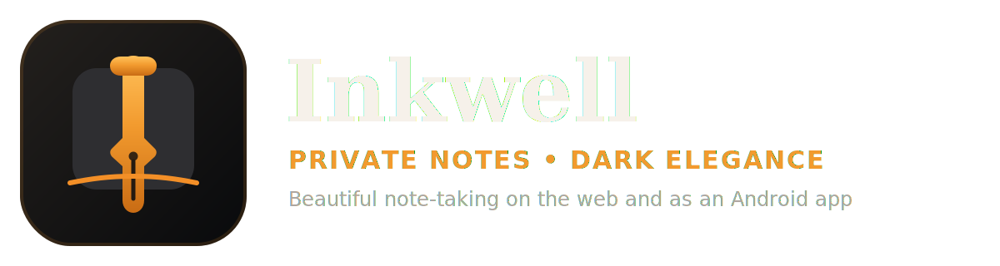

<div align="center">



# Inkwell

**Beautiful, private note-taking — on the web and as an Android app**

<a href="https://github.com/tharindu899/Inkwell/releases/latest">
  
</a>

<br />


<br />

> Write beautifully, anywhere. Notes live **locally on your device** and sync privately to your own Google Drive.

</div>

---

## 📋 Table of Contents

| | | |
|---|---|---|
| [📥 Download](#-download) | [✨ Features](#-features) | [🛠️ Tech Stack](#️-tech-stack) |
| [⚡ Quick Start](#-quick-start) | [🌐 Deploy to Vercel](#-deploy-to-vercel) | [📱 Build Android APK](#-build-android-apk) |
| [🔑 GitHub Secrets](#-github-secrets) | [☁️ Google Drive Sync](#️-google-drive-sync) | [⚙️ Environment Variables](#️-environment-variables) |
| [🚀 CI/CD Pipeline](#-cicd-pipeline) | [🗄️ Data Model](#️-data-model) | [🔧 Troubleshooting](#-troubleshooting) |
| [✅ Release Check](#-release-check) | [📚 Docs](#-docs) | [📲 App Updates](#-app-updates) |
| [🎨 Android Icon](#-android-icon) | [📄 License](#-license) | |

---

## 📥 Download

<p align="center">
  <a href="https://github.com/tharindu899/Inkwell/releases/latest">
    
  </a>
</p>

Install from **GitHub Releases**. The app also includes an in-app updater from **Settings → Check for updates**.


## 🎨 App Icon & Branding

<p align="center">
  
</p>

Inkwell uses the **v27 dark/orange icon style** to match the app UI.

| Asset | Purpose |
|------|---------|
| `public/icon.svg` | Scalable icon for browser, README, and app branding |
| `public/logo.svg` | Wide README/header logo |
| `public/logo.png` | PNG logo fallback |
| `public/icon-512.png` | Master PNG used for Android/PWA icon generation |
| `public/icon-*.png` | PWA and launcher sizes |
| `public/favicon-*` | Browser tab icons |
| `public/apple-touch-icon.png` | iOS home-screen icon |
| `docs/app-icon-preview.png` | README preview image |

GitHub Actions regenerates Android launcher/adaptive icons from `public/icon-512.png` during every APK build.

See [`docs/ANDROID_ICON.md`](docs/ANDROID_ICON.md).

---

## ✨ Features

<table>
<tr>
<td width="50%" valign="top">

### 📝 Rich Text Editor
- **Bold** · *Italic* · <u>Underline</u> · ~~Strike~~ · Highlight
- H1 / H2 / H3 headings
- Bullet · Ordered · ✅ Checklist
- Blockquote · Code blocks · Tables · HR
- Left / Center / Right align
- Inline links & URL popover
- 📅 Date / time insert
- ↩️ Undo / Redo
- ⌨️ Markdown shortcuts (`#`, `-`, ` ``` `)
- 🔧 Customisable toolbar (show/hide buttons)
- 💾 Auto-save (2 s debounce) + `Ctrl+S`
- 📖 Reading mode (distraction-free)
- 🔢 Live word & character count
- 🛡️ Safer auto-save/background-save behavior
- 🏷️ Saved tag chips for quick tag selection in the editor

</td>
<td width="50%" valign="top">

### 🗂️ Organise & Manage
- 📌 Pin / unpin notes (long-press)
- 🗑️ Delete with haptic feedback
- 🏷️ Tags — add with Enter or comma
- 📒 Assign to a notebook from the editor
- 📤 Export as `.txt` · `.md` · `.xls` · `.pdf`
- 📚 Notebooks with custom colour & icon
- 🔍 Full-text search with match highlighting
- 🔎 Filter by: All · Title · Content · Tags
- 🕐 Recent search history (max 8)
- ☁️ Filter search by notebook
- ☁️ Google Drive auto-backup
- 🔄 Cross-tab sync via storage events
- 📶 Offline banner on network loss

</td>
</tr>
<tr>
<td valign="top">

### 🏆 Profile & Stats
- 🖼️ Google account avatar + name
- 📊 Notes · Notebooks · Word count stats
- 🔥 Writing streak (current + longest)
- 📅 14-week activity heatmap grid
- ⚙️ Quick links to Settings & Notebooks

</td>
<td valign="top">

### ⚙️ Settings & Preferences
- 🌙 Dark / ☀️ Light theme toggle
- 🔡 Font size: Small · Medium · Large
- ☁️ Manual Drive backup & restore
- 📥 Import / 📤 Export all notes as JSON
- 🧹 Clear all data (with confirmation)
- 🔔 Check for APK updates
- 📦 Storage usage display (KB)

</td>
</tr>
<tr>
<td valign="top">

### 🤖 Android Native
- ⬅️ Hardware back button (exits app from Home)
- 📋 Copy/select blocked outside editor
- 📳 Haptic feedback (light · medium · heavy)
- 🎨 App icon auto-generated from `icon-512.png`
- 📤 Share sheet after file export

</td>
<td valign="top">

### 🔔 Auto-Update Checker
- 🚀 Checks GitHub Releases on open + resume
- 📬 Bottom-sheet prompt when newer version found
- 📥 In-app APK download with MB/percent progress
- 🔕 Per-version dismissal (won't re-show same ver)
- 📦 Opens Android Package Installer directly
- 🧹 Deletes temporary downloaded APK from cache

</td>
</tr>
</table>

---

## 🛠️ Tech Stack

<div align="center">

| Layer | Tool | Badge |
|-------|------|-------|
| ⚡ Bundler | Vite 5 |  |
| ⚛️ UI | React 18 JSX |  |
| 🗺️ Routing | React Router v6 (HashRouter) |  |
| 🔄 State | Context + `useReducer` |  |
| 💾 Storage | `localStorage` |  |
| 🎨 Styling | Plain CSS |  |
| 🎯 Icons | Font Awesome 6.5 CDN |  |
| 🔐 Auth | Google Identity Services (OAuth 2.0) |  |
| ☁️ Sync | Google Drive REST API v3 |  |
| 📱 Android | Capacitor 6 |  |
| 🌐 Deploy | Vercel |  |
| 🤖 APK CI | GitHub Actions |  |
| 🟢 Runtime | Node.js 20.x |  |

</div>

<details>
<summary>📦 Capacitor plugins used</summary>

| Plugin | Purpose |
|--------|---------|
| `@capacitor/app` | ⬅️ Back button + app resume event |
| `@capacitor/filesystem` | 💾 Native file save for exports |
| `@capacitor/haptics` | 📳 Vibration feedback |
| `@capacitor/share` | 📤 Share sheet after export |
| `@capacitor/browser` | 🌐 Open URLs in system browser |
| `@codetrix-studio/capacitor-google-auth` | 🔐 Native Google Sign-In (Android) |

</details>

---

## 🗂️ Project Structure

```text
📦 inkwell/
├── 🌐 public/
│   ├── 🖼️ icon.svg                    # Main scalable app icon
│   ├── 🖼️ logo.svg / logo.png          # README/header brand logo
│   ├── 📱 icon-*.png                   # PWA + launcher icon sizes
│   ├── 🌟 favicon-16.png / favicon-32.png
│   ├── 🍎 apple-touch-icon.png
│   ├── 📄 manifest.json                # PWA web app manifest
│   └── ⚙️ sw.js                        # Service Worker
│
├── 📚 docs/
│   ├── 📲 APP_UPDATE_INSTALL.md        # In-app APK updater/install flow
│   ├── 🎨 ANDROID_ICON.md              # Android adaptive icon sizing
│   ├── ✅ RELEASE_CHECK.md             # Release safety checklist
│   ├── 📝 CHANGELOG.md                  # App update history
│   ├── 👋 WELCOME_NOTE.md                # Welcome note toolbar examples
│   ├── 🌓 THEME.md                     # Theme persistence notes
│   ├── ✍️ EDITOR.md                    # Editor stability checklist
│   └── 🖼️ app-icon-preview.png         # Icon preview for README
│
├── 🧰 scripts/
│   └── ✅ release-check.mjs            # Local release validation script
│
├── ⚛️ src/
│   ├── 🚀 main.jsx                     # Entry: HashRouter + providers
│   ├── 🗺️ App.jsx                      # Routes + back button + offline banner
│   │
│   ├── 🔐 auth/
│   │   ├── 🔑 AuthContext.jsx          # Google OAuth web/native
│   │   └── ☁️ googleDrive.js           # Google Drive backup/restore
│   │
│   ├── 🗄️ store/
│   │   ├── 🔄 AppContext.jsx           # Global notes/notebooks state
│   │   └── 💾 storage.js               # localStorage CRUD helpers
│   │
│   ├── 📄 pages/
│   │   ├── 🔑 Login.jsx                # Google sign-in
│   │   ├── 🏠 Home.jsx                 # Dashboard + pinned/recent notes
│   │   ├── ✍️ Editor.jsx               # Rich editor + markdown + reading mode
│   │   ├── 📚 Notebooks.jsx            # Notebook list / CRUD
│   │   ├── 📖 NotebookDetail.jsx       # One notebook's notes
│   │   ├── 🔍 Search.jsx               # Full-text search
│   │   ├── 🏷️ Tags.jsx                 # Tag list + tag notes
│   │   ├── 👤 Profile.jsx              # User stats
│   │   └── ⚙️ Settings.jsx             # Theme, sync, update, import/export
│   │
│   ├── 🧩 components/
│   │   ├── 🔝 TopBar.jsx
│   │   ├── 🔻 BottomNav.jsx
│   │   ├── ➕ Fab.jsx
│   │   ├── 📝 NoteCard.jsx
│   │   ├── 📭 EmptyState.jsx
│   │   ├── 🔔 Toast.jsx
│   │   └── 📲 UpdateChecker.jsx        # GitHub Release APK updater
│   │
│   ├── 🪝 hooks/
│   │   ├── 🌓 useTheme.js              # Persistent dark/light theme
│   │   └── 👋 useGreeting.js
│   │
│   ├── 🛠️ utils/
│   │   ├── 📤 exportNote.js            # TXT / MD / XLS / PDF export
│   │   ├── 📳 haptics.js
│   │   ├── 🧮 helpers.js
│   │   └── 🌱 seed.js
│   │
│   └── 🎨 styles/
│       └── 🎨 styles.css               # Full app styling
│
├── 🤖 .github/workflows/
│   └── 📦 build-apk.yml                # Build signed APK + GitHub Release
│
├── 🔐 .env.example
├── 🚫 .gitignore
├── 📱 capacitor.config.json
├── 🌐 index.html
├── 📦 package.json
├── 🔒 package-lock.json
├── 🚀 push.sh
├── ▲ vercel.json
└── ⚡ vite.config.js
```

### 🚫 Do not commit generated/sensitive files

```text
node_modules/
dist/
android/
.env
*.jks
keystore.txt
```

---

## ⚡ Quick Start

```bash
# 1️⃣  Clone the repo
git clone https://github.com/tharindu899/Inkwell.git
cd Inkwell

# 2️⃣  Set up environment
cp .env.example .env
# → Edit .env and set VITE_GOOGLE_CLIENT_ID

# 3️⃣  Install & run
npm install
npm run dev
```

> 🌐 Opens at **http://localhost:5173**

---

## 🌐 Deploy to Vercel

```
1. Push your repo to GitHub
2. vercel.com/new  →  import repo
3. Framework: Vite  |  Build: npm run build  |  Output: dist
4. Add env var: VITE_GOOGLE_CLIENT_ID = <your client id>
5. Deploy 🚀
```

`vercel.json` handles SPA rewrites + correct cache headers automatically.

---

## 📱 Build Android APK

> 💡 No PC needed — works fully from **Termux** on your phone.

### Step 1 — Create a signing keystore

```bash
pkg install openjdk-17

keytool -genkeypair -v \
  -keystore inkwell-release.jks \
  -alias inkwell \
  -keyalg RSA -keysize 2048 -validity 10000 \
  -storepass YOUR_STORE_PASSWORD \
  -keypass  YOUR_KEY_PASSWORD \
  -dname "CN=Inkwell, OU=App, O=Personal, L=City, S=State, C=US"

base64 inkwell-release.jks > keystore.txt
cat keystore.txt   # ← copy ALL of this output
```

> ⚠️ **Keep `inkwell-release.jks` safe.** Losing it means you can't update the app later.

---

### Step 2 — Push to GitHub

```bash
pkg install git
git config --global user.name  "Your Name"
git config --global user.email "you@email.com"

git init && git add .
git commit -m "Initial commit"
git branch -M main
git remote add origin https://github.com/YOUR_USERNAME/YOUR_REPO.git
git push -u origin main
```

---

### Step 3 — Add GitHub Secrets

`Your repo → Settings → Secrets and variables → Actions → New repository secret`

---

## 🔑 GitHub Secrets

| Secret | Value | Required |
|--------|-------|:---:|
| `KEYSTORE_BASE64` | Full base64 from `cat keystore.txt` | ✅ |
| `KEY_ALIAS` | `inkwell` (your chosen alias) | ✅ |
| `KEY_PASSWORD` | Your keypass value | ✅ |
| `STORE_PASSWORD` | Your storepass value | ✅ |
| `VITE_GOOGLE_CLIENT_ID` | Google OAuth 2.0 Client ID | ✅ |
| `VITE_GITHUB_REPO` | Optional local override; workflow uses `github.repository` | ➖ |
| `VITE_GITHUB_TOKEN` | Not recommended for public APK builds | ❌ |

---

### Step 4 — Fix Google OAuth for Android

In [Google Cloud Console](https://console.cloud.google.com/) → Credentials → your OAuth Client → **Authorised JavaScript origins**, add:

```
https://localhost
```

> Required because Capacitor serves the app from `https://localhost` inside Android WebView.

Also create a separate **Android OAuth credential** (type: Android) with:
- Package name: `com.inkwell.notes`
- SHA-1: found in the GitHub Actions **job summary** after your first build

---

### Step 5 — Get your APK

```
GitHub → Actions → your workflow run → wait ~5 min → Artifacts → download APK
```

Or grab it from the **Releases** tab — the CI creates one automatically. ✅

To install: open APK on phone → Install
_(Enable: Settings → Security → Install unknown apps)_

---

### Step 6 — Release new versions

Every `git push` to `main` auto-creates a GitHub Release. The CI derives the version from the run number:

```
Run #45  →  v1.4.5      Run #106  →  v2.0.6

MAJOR = floor(run / 100) + 1
MINOR = floor((run % 100) / 10)
PATCH = run % 10
```

The in-app update checker compares this version against the latest GitHub Release and prompts users to download if newer.

---

## ⚙️ Environment Variables

| Variable | Required | Description |
|----------|:---:|-------------|
| `VITE_GOOGLE_CLIENT_ID` | ✅ | Google OAuth 2.0 Client ID — [get one here](https://console.cloud.google.com/) |
| `VITE_GITHUB_REPO` | Optional local override; workflow uses `github.repository` | ➖ |
| `VITE_GITHUB_TOKEN` | Not recommended for public APK builds | ❌ |

<details>
<summary>🔐 How to get a Google Client ID</summary>

1. [Google Cloud Console](https://console.cloud.google.com/) → create/select a project
2. **APIs & Services → Library** → enable **Google Drive API**
3. **APIs & Services → OAuth consent screen** → External → add scope `.../auth/drive.appdata`
4. **Credentials → Create → OAuth 2.0 Client ID** → Web application
5. Authorised JavaScript origins:
   - `http://localhost:5173` (local dev)
   - `https://your-app.vercel.app` (production)
   - `https://localhost` (Android WebView — **required**)
6. Copy the **Client ID**

</details>

---

## 🚀 CI/CD Pipeline

```
📤 git push main
        │
        ▼
① 🔍  Checkout + Node 20 + npm install
② 🩹  Patch GoogleAuth plugin (add Drive scope to native token)
③ 🔢  Derive version from run number  →  TAG, VERSION, APK_NAME
④ 📝  Write version into package.json  (so VITE_APP_VERSION matches tag)
⑤ 🏗️   npm run build  →  dist/ (Vite)
⑥ 📱  npx cap add android  →  android/ (Capacitor project)
⑦ 🎨  Generate Android launcher/adaptive icons from icon-512.png
⑧ ☕  Set up JDK 21 + Android SDK (API 35)
⑨ 🔗  Patch native APK installer + npx cap sync android
⑩ 🔓  Decode KEYSTORE_BASE64  →  inkwell-release.jks
⑪ 🔑  Print SHA-1 to job summary (for Google Cloud Console setup)
⑫ 🔨  ./gradlew assembleRelease  →  signed APK
⑬ 📦  Rename APK  →  Inkwell-v{VERSION}.apk
⑭ ⬆️   Upload as workflow artifact (retained 30 days)
⑮ 🎉  Create GitHub Release with APK attached
⑯ 📲  Native updater downloads APK inside app from Releases
```

---

## ☁️ Google Drive Sync

> 🔒 Backup file lives in `appDataFolder` — **never visible in your My Drive.**

**Backup** (`inkwell-sync.json`):

| Step | What happens |
|------|-------------|
| ✏️ You edit a note | 1.2 s debounce timer starts |
| ⏱️ Timer fires | Cached token used (no popup) |
| 📤 Drive call | `PATCH` if file exists · `POST multipart` if new |
| ✅ Done | `iw_last_auto_backup` updated in localStorage |

**Restore on login:**

| Condition | Behaviour |
|-----------|-----------|
| 🆕 Fresh install / only welcome note | Cloud data replaces local entirely |
| 📱 Existing notes present | Merge by ID — newer `updatedAt` wins |
| ✅ After merge | Merged result pushed back to Drive |

Manual backup / restore also available in **Settings**.

---

## 🗄️ Data Model

<details>
<summary>📋 localStorage keys</summary>

| Key | Content |
|-----|---------|
| `iw_notes` | JSON array of note objects |
| `iw_notebooks` | JSON array of notebook objects |
| `iw_profile` | `{ name, email, joinDate }` |
| `iw_theme` | `"dark"` or `"light"` |
| `iw_fontSize` | `"small"` · `"medium"` · `"large"` |
| `iw_sort` | `"modified"` · `"created"` · `"title"` · `"tags"` |
| `iw_searches` | Up to 8 recent search strings |
| `iw_gauth` | Cached Google user + access token + expiry |
| `iw_prefs` | Miscellaneous UI preferences |
| `iw_last_auto_backup` | ISO timestamp of last Drive backup |
| `iw_last_cloud_sync` | Drive file `modifiedTime` |

</details>

<details>
<summary>📝 Note object shape</summary>

```json
{
  "id": "lp3abc12x",
  "title": "My Note",
  "content": "<p>HTML from editor</p>",
  "tags": ["work", "ideas"],
  "notebookId": "lp1xyz99a",
  "pinned": false,
  "wordCount": 42,
  "createdAt": "2025-01-01T10:00:00.000Z",
  "updatedAt": "2025-01-15T14:30:00.000Z"
}
```

</details>

<details>
<summary>📚 Notebook object shape</summary>

```json
{
  "id": "lp1xyz99a",
  "name": "Work",
  "color": "#6090e0",
  "icon": "fa-briefcase",
  "createdAt": "2025-01-01T09:00:00.000Z"
}
```

</details>

---

## 📁 What to Commit

```
✅  DO commit                  ❌  NEVER commit
─────────────────────────────────────────────────
src/                           dist/          ← Vite output
public/                        android/       ← Capacitor output
docs/
index.html                     node_modules/
package.json                   inkwell-release.jks  ← signing key!
capacitor.config.json          keystore.txt         ← base64 key!
vite.config.js                 .env                 ← has your secrets
vercel.json
.env.example
.gitignore
.github/workflows/build-apk.yml
```

---

## ✅ Release Check

Before publishing or creating a new release, run the release check from the project root:

```bash
npm ci
npm run release:check
```

The full checklist is in [`docs/RELEASE_CHECK.md`](docs/RELEASE_CHECK.md). It covers required GitHub secrets, files that must not be committed, and the expected clean build checks.

---

## 🔧 Troubleshooting

| 🚨 Symptom | 💡 Cause | ✅ Fix |
|-----------|---------|-------|
| Sign-in button stuck "loading" | `VITE_GOOGLE_CLIENT_ID` missing | Add to `.env` or Vercel env vars |
| `Sign-in failed` on Android | Missing Android OAuth credential | Add Android credential in GCloud Console (SHA-1 + package `com.inkwell.notes`) |
| Drive backup/restore does nothing | Token expired or Drive scope missing | Sign out → sign in again; re-run CI |
| APK build: `SDK location not found` | `setup-android` step failed | Re-run the workflow |
| APK build: `KEYSTORE_BASE64` error | Secret missing or bad base64 | Re-encode keystore, update secret |
| Update checker: "Repo not found" | `VITE_GITHUB_REPO` secret missing or wrong | Set it to `your-username/your-repo` in GitHub Secrets → Actions |
| Update checker: "rate limited" | Too many API calls (60/hr limit) | Set `VITE_GITHUB_TOKEN` with `contents:read` |
| Notes not syncing across tabs | Browser blocking storage events | Check browser privacy/storage settings |
| White screen on Android | Absolute URL paths failing in WebView | Confirm `base: './'` in `vite.config.js` + `HashRouter` is used |

---

## 🧠 Key Design Decisions

<details>
<summary>🔍 Why HashRouter instead of BrowserRouter?</summary>

Android WebView serves assets from the filesystem — there's no server to fall back to `/index.html` for deep links. `HashRouter` keeps navigation in the URL hash (`https://localhost/#/editor`), which works perfectly on-device.

</details>

<details>
<summary>📂 Why `base: './'` in vite.config.js?</summary>

Capacitor copies the built `dist/` folder into the Android project. Absolute asset paths (`/assets/...`) fail when loading from the filesystem. Relative paths (`./assets/...`) work correctly in both WebView and browser.

</details>

<details>
<summary>🩹 Why does the CI patch the GoogleAuth plugin?</summary>

`@codetrix-studio/capacitor-google-auth` only requests `profile email` by default. The CI patches the plugin's Java source to add `https://www.googleapis.com/auth/drive.appdata` *before* Capacitor generates the Android project, because native Google Sign-In must request all scopes upfront — they can't be added silently later.

</details>

<details>
<summary>📋 Why is copy/select blocked outside the editor?</summary>

Android WebView lets users long-press and copy UI labels. `CopySelectGuard` intercepts `copy`, `cut`, and `selectstart` events globally, allowing them only when the event target (or selection nodes) are inside `.editor-body`, `.editor-title`, or `[data-inkwell-copy-ok="1"]`.

</details>

---

---


### Light mode code block fix

Code blocks now use a readable light surface in light theme, with dark text and visible copy/action buttons.


---

## 📚 Docs

The `docs/` folder keeps release/setup notes separate from the main README.

| Doc | Purpose |
|-----|---------|
| [`docs/APP_UPDATE_INSTALL.md`](docs/APP_UPDATE_INSTALL.md) | In-app APK update, installer, and cleanup flow |
| [`docs/ANDROID_ICON.md`](docs/ANDROID_ICON.md) | Android adaptive icon size and safe-zone notes |
| [`docs/THEME.md`](docs/THEME.md) | Light/dark theme persistence details |
| [`docs/EDITOR.md`](docs/EDITOR.md) | Editor save, markdown, paste, tag chips, and mobile stability notes |
| [`docs/RELEASE_CHECK.md`](docs/RELEASE_CHECK.md) | Final checks before publishing a public release |
| [`docs/CHANGELOG.md`](docs/CHANGELOG.md) | Full app update history and release notes template |
| [`docs/WELCOME_NOTE.md`](docs/WELCOME_NOTE.md) | App welcome note and editor toolbar examples |

Recommended reading order:

1. `RELEASE_CHECK.md`
2. `ANDROID_ICON.md`
3. `APP_UPDATE_INSTALL.md`
4. `THEME.md`
5. `EDITOR.md`


---

## 📝 Changelog

Full update history is available in [`docs/CHANGELOG.md`](docs/CHANGELOG.md).

For the in-app update popup, write the newest changes in the **GitHub Release description/body**. Inkwell reads that release body and shows the short changelog in the update sheet.

Recommended release body format:

```md
## Inkwell v1.0.9

### Fixed
- Added selected delete confirmation
- Added 5-second Undo after delete
- Fixed Tags page selected/unselected colors

### Install
Tap Install in the app update popup or download the APK below.
```


## 📲 App Updates

Inkwell checks GitHub Releases for a newer Android APK. The app uses the GitHub Release description/body as changelog text for the update popup.

### What the update popup shows

| State | Result |
|------|--------|
| Current APK is older | **New APK update available** + **Install** |
| Current APK matches latest release | **You are already updated** |
| Release has no APK asset | Opens the GitHub Release page |
| In-app install is blocked | Falls back to the release page |

### Download & install flow

1. Open **Settings → Check for updates**.
2. Inkwell checks the latest GitHub Release for `tharindu899/Inkwell`.
3. If a newer APK exists, the popup shows:
   - latest version
   - installed version
   - APK size
   - download count
   - repo name
   - MB / percent progress bar
4. Tap **Install**.
5. The APK downloads inside the app.
6. Android Package Installer opens directly.
7. Tap **Install / Update** manually.
8. The temporary downloaded APK is deleted from app cache after a short delay.

> Android does **not** allow silent APK updates for normal apps, so the final Install/Update tap is required.

See [`docs/APP_UPDATE_INSTALL.md`](docs/APP_UPDATE_INSTALL.md).

---

## 🎨 Android Icon

The APK build uses correct Android launcher/adaptive icon sizes and safe-zone padding so MIUI/Android launchers do not crop the icon badly.

See [`docs/ANDROID_ICON.md`](docs/ANDROID_ICON.md).


---

## 🌓 Theme Persistence

Theme selection is saved in `iw_theme` and applied before React renders, so light mode stays active after closing and reopening the Android app.

See [`docs/THEME.md`](docs/THEME.md).


## 📄 License

Personal project — see the repository for any licence details.

---

<div align="center">

Made with 🖊️ by [tharindu899](https://github.com/tharindu899)

⭐ **Star the repo if you find it useful!**

</div>


- Tag selector updated: the editor footer now stays compact, and full tag management opens in a modal.

- Manage Tags modal is now compact, smaller, and uses a 2-column action layout.

- Manage Tags modal now uses horizontal scrolling compact tag chips and removes duplicate Add controls.

- Editor tag selector now matches the notebook selector style, and the Tags page uses compact note-like tag pills.

- Tags page uses independent note-size tag pills, and notebook badges use the matching notebook icon.

- Added selected delete confirmation modal with 5-second Undo toast.

- App welcome note demonstrates all main editor toolbar options for first-time users.

- App welcome note refreshes only the built-in `welcome-note`; it does not overwrite user notes.

- Added full toolbar examples inside the actual app welcome note.

- Added GitHub theme as the third app appearance option.

- Welcome note no longer shows a fixed version tag; it can refresh through internal seed updates.
